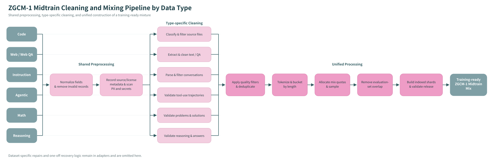

# ZGCM-1 Midtrain Cleaning and Mixing Pipeline by Data Type

The diagram retains operations that generalize across a data type. Dataset-specific field repairs, temporary thresholds, infrastructure paths, and one-off recovery rules belong in adapters or runtime configuration.

## Inclusion rule

An operation belongs in the main pipeline when at least one of the following holds:

1. It recurs across multiple datasets in the same category.
2. It has only been deployed once but is clearly reusable across that category.
3. It is required for a reproducible training-data release, such as provenance, deterministic mixing, manifests, checksums, and loader validation.

The following remain outside the main pipeline:

- fixes for a dataset-specific legacy field;
- regular expressions tied to one dataset revision;
- one-off recovery routes;
- absolute paths, Kubernetes jobs, PVCs, images, and worker counts;
- model-version-specific special-token IDs or experimental boundary policies.

## Category-specific operations

### Code

Detect languages and file types, remove vendored/generated/non-source assets, and validate source-code, FIM, QA, and patch structure.

### Web / Web QA

Extract main text or QA fields, remove templates/navigation/repeated spans, and validate QA completeness, unknown answers, and grounding signals.

### Agentic

Normalize messages, tools, actions, and observations; validate role ordering and tool-call/observation pairing; and inspect completion, test, timeout, and abnormal-exit signals.

### Instruction

Normalize prompt/response/messages, validate role and response completeness, and remove generic model boilerplate, refusals, system residue, and degenerate repetition.

### Math and Reasoning

Normalize problem/reasoning/final-answer fields, validate reasoning and answer completeness, detect missing multimodal context, verify terminal answers, and remove prompt/control artifacts while preserving lineage.

## Training-ready output contract

The pipeline does not stop at cleaned category buckets. It must also:

1. apply source-aware quality policies;
2. deduplicate within and across sources;
3. calculate lengths with the actual training tokenizer;
4. allocate exact quotas from normalized mixture weights;
5. deterministically shuffle, sample, and interleave the selected records;
6. remove overlap with held-out benchmarks and evaluation sets;
7. write mixed shards, release manifests, checksums, and the training loader's indexed format;
8. validate document/token counts, source and length distributions, checksums, and loader compatibility.

Only after these checks is the output considered the training-ready ZGCM-1 Midtrain mix.
